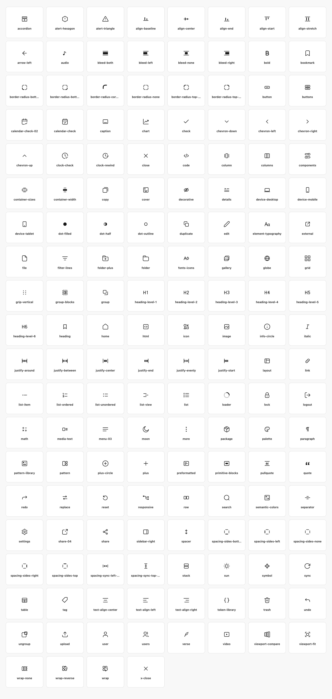

<div align="center">

# Publr Icons

**The icon set behind Publr. SVG is the source**



</div>

---

Set of 156 shared UI icons for publr products. Size 24x24. Framework, language and package manager agnostic. It's just SVGs.

This project ships with Zig adapter.

Every icon can be easily used both client and server side.

Social and brand icons do not belong here. They will have their own package.

## Layout

- `icons/*.svg` — canonical 24×24 UI artwork.
- `src/index.ts` — browser/TypeScript adapter.
- `publr_icons.zig` — Zig adapter for the design-system and CMS.
- `manifest.json` — stable machine-readable icon inventory.
- `index.html` — generated, self-contained all-icons gallery.
- `figma-plugin/` — local Figma plugin that creates editable components.
- `scripts/build.zig` — validates SVGs and regenerates every adapter (`zig build gen`).

## Browser and editor

Every icon in a page is a `<use>` pointing into one hidden sprite. The sprite
is a fact about the page, not something a consumer arranges: a server writes
it with the icons it rendered, and the browser adds whatever it renders on top.

```ts
import { icon } from "@publr/icons";

button.innerHTML = icon("plus", "size-5");
```

That returns `<svg class="size-5"><use href="#publr-icon-plus"/></svg>` and, if
the page's sprite does not hold `plus` yet, adds it, creating the sprite on
first use. `iconSvg("plus")` inlines the artwork instead, for markup that
leaves the page, and `sprite(names)` returns the sprite as a string for a page
assembled outside the browser.

The package has no runtime dependencies. Sibling repos import `../icons/src/index.ts` by path.

## Zig and CMS (no npm)

Sibling repos reference the committed Zig adapter by path and register it as a build module:

```zig
const publr_icons = b.createModule(.{
    .root_source_file = b.path("../icons/publr_icons.zig"),
});
```

Nothing runs npm and nothing fetches icons at runtime.

## Development

```sh
zig build gen    # validate icons/*.svg and regenerate every artifact
zig build test   # generator tests, plus proof the committed artifacts are current
zig build serve  # the gallery at http://127.0.0.1:8092 (zig build serve -- --port 9000)
```

Zig only; the generator has no dependencies. Generated files must be committed
with SVG changes, and `zig build test` fails until they are.

Open `index.html` directly to browse every icon, search by name, switch theme,
and click an icon to copy its canonical name.

## Create a native Figma file

1. Create or open an empty Figma Design file.
2. Open **Plugins → Development → Import plugin from manifest…**.
3. Select `figma-plugin/manifest.json` from this repository.
4. Run **Plugins → Development → Generate Publr Icons**.
5. Verify the generated `Publr Icons` page, then choose
   **File → Save local copy** to produce a genuine `.fig` file.

The plugin creates one editable 24×24 component per manifest icon, names them
as `Icon/<name>`, arranges them in a preview grid, and adds SVG export settings.
It performs no network requests. Running it in a non-empty file creates a new
page instead of deleting or replacing existing work.

## Part of Publr

| Repository | What it is |
|---|---|
| [publr](https://github.com/publr-org/publr) | the CMS, one binary |
| [ui](https://github.com/publr-org/ui) | the design system, one PTSX source for both targets |
| [pjsx](https://github.com/publr-org/pjsx) | the PTSX compiler: DOM and Zig targets |
| [publrjs](https://github.com/publr-org/publrjs) | the browser runtime behind the `data-p-*` wire |
| [jit](https://github.com/publr-org/jit) | classes to CSS, at build time or in the browser |
| [lib](https://github.com/publr-org/lib) | the Zig libraries: sqlite, http, auth, deps |

## License

[Apache 2.0](LICENSE)
